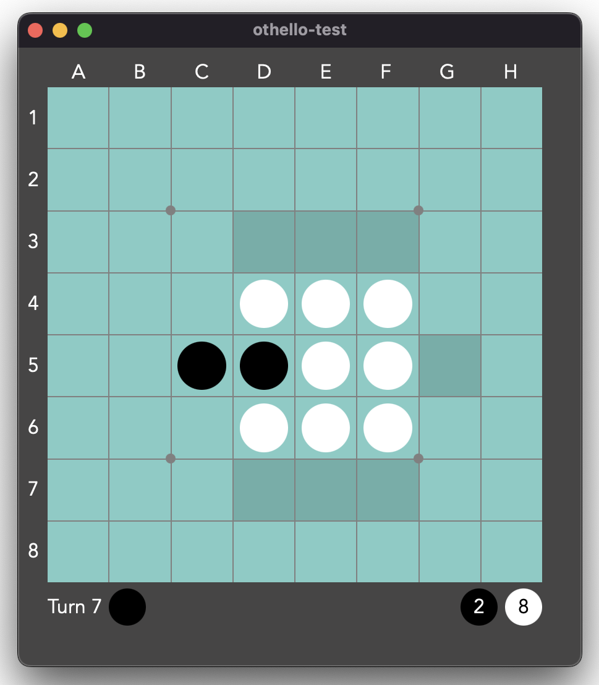

# othello-study
An Othello program to try out Rust.



## Environment
Install the followings.

- Rust 1.66.0
- Node.js 16.14.2
- Tauri-cli 1.2.2

Probably slightly different versions will work.

### Instal Rust

Run the following in your terminal, then follow the on-screen instructions. 

```shell
curl --proto '=https' --tlsv1.2 -sSf https://sh.rustup.rs | sh
```

### Install Node.js

https://nodejs.org/


## Setup Project
After cloning, run the following script in the project directory.

```shell
npm install
```

## Run

Use a npm-script named 'tauri' in 'othello-test/package.json' with 'dev' option to run the application.

```shell
npm run tauri dev
```

## Unit Test

"dist" directory is needed in the project root to run Rust unit tests.